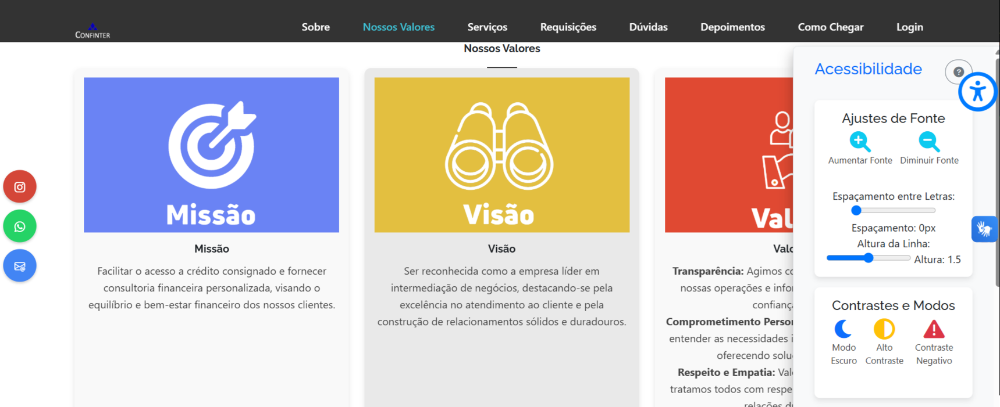

# 🕹 Criação do Projeto Integrador em Computação II - Turma-006 - UNIVESP
> Criação do Projeto Integrador PI - II UNIVESP 

## 📋 Índice
- [Link do projeto:Homologação](http://confinter.rf.gd/)
- [Link do projeto:Produção](http://confinter.com.br)

- [📖 Sobre](#-Sobre)
- [🚀 Tecnologias utilizadas](#-Tecnologias-utilizadas)
- [🖥 Preview "Vercel sem acesso ao BD"](https://drp-01-projeto-integrador-em-computa-o-ii-turma-006.vercel.app/)
- [📌 Créditos](#-Créditos)

## 📖 Sobre
 - Criação do Projeto Integrador PI - II UNIVESP

## 🚀 Tecnologias utilizadas
- `PHP`
- `HTML`
- `CSS`
- `Javascript`
- `MSQL`
- `Framework - Bootstrap`
- `GitHub`
- `SQL`
- `MySQL Workbench`
- `Visual Studio Code`
- `dash.infinityfree.com`
## 🖥 Preview:

  

   

